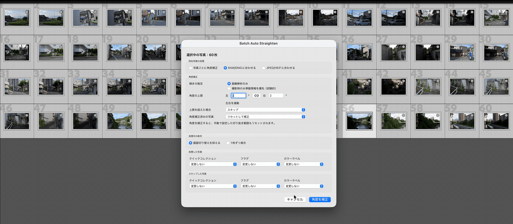

# Batch Auto Straighten

[日本語](#batch-auto-straighten-日本語)

**Straighten a whole batch of photos in Lightroom Classic in one step.**

Select the photos, run the plug-in, and each one gets its own straighten angle. RAW and JPEG versions of the same shot can be kept at the same angle. Everything runs on your Mac; your photos are never uploaded.

Until now, leveling many photos at once in Lightroom Classic meant using Transform (Upright). Batch Auto Straighten uses the familiar **Crop & Straighten** angle instead — the same one you would set by hand — for every selected photo in one run.

*60 photos straightened in one run. Processing is shown at 4× speed.*

## What It Does

Batch Auto Straighten estimates the tilt of each photo with its own analysis (not Lightroom's built-in Auto) and saves the result as the angle in **Crop & Straighten**. You can review and fine-tune any angle afterward, just as if you had set it yourself. Transform / Upright settings are not changed.

Photos with no clear horizon or vertical lines may still need a manual touch-up.

## Requirements

- Adobe Lightroom Classic
- A Mac with Apple silicon (M series), macOS 26 or later
- Access to the original photo files. Videos and photos whose originals are missing are skipped, and Smart Previews alone are not enough.

You do not need to install Python or Xcode. Windows and Intel Macs are not supported. The plug-in appears in English, or in Japanese when Lightroom Classic is set to Japanese.

## Install and Update

1. Download the latest `.dmg` or `.zip` from [GitHub Releases](https://github.com/mssoftjp/batch-auto-straighten/releases). Both contain the same plug-in.
2. Open the DMG or unzip the ZIP, then copy `BatchAutoStraighten.lrplugin` to a folder on your Mac where it can stay, such as a **Lightroom Plug-ins** folder in your home folder. Do not register the copy inside the DMG.
3. In Lightroom Classic, choose **File → Plug-in Manager**, click **Add**, and select the copied plug-in.
4. Make sure it is enabled, then click **Done**.

If you move the plug-in folder later, add it again in Plug-in Manager.

**To update**, quit Lightroom Classic, replace the old copy with the new one, then reopen Lightroom Classic and check the version in Plug-in Manager.

## Straighten Your Photos

1. Select the photos in Lightroom Classic.
2. Choose **Library → Plug-in Extras → Batch Auto Straighten** (also available under **File → Plug-in Extras**).
3. Check the settings. Hover over any control for a short explanation.
4. Click **Straighten Photos**, then review the results.

For your first run, try a handful of photos to see how the results look. Your settings are saved when you click **Straighten Photos** and used again next time.

## Choosing Settings

### Photos with the Same Name

If you shoot RAW + JPEG, the plug-in can give both files the same angle.

- **Match to RAW/DNG** (default) or **Match to JPEG/HEIF**: Straightens one photo as the reference and applies its angle to the others. If no photo in that format is available, another eligible photo becomes the reference.
- **Straighten each photo**: Handles every photo on its own.

Photos are matched only when they are selected, in the same folder, and share the same name apart from the extension (for example, `DSC0001.ARW` and `DSC0001.JPG`). Select every file you want to match.

### Tilt Estimation

- **Prefer camera level (experimental)** (default): Uses the level recorded by the camera when it is available and still fits the photo's current edits, and image analysis otherwise.
- **Image analysis only**: Always estimates tilt from the image.

Sony camera level data is not supported, so Sony photos always use image analysis.

### Angle Limits

A large correction may be a misreading, so you can set how far the plug-in may rotate a photo without asking. Limits range from 0° to 45° and default to 3° for both left and right. They are linked; click the chain button between the fields to set them separately.

The limit applies to the final angle, not to how much the angle changes.

When a correction goes over the limit, choose **Review First** (default) to decide photo by photo, or **Skip** to leave those photos untouched. In the review dialog, the white frame shows the approximate crop after correction:

- **Apply Angle** or **Skip**: Decides this correction. If this is the reference photo for a same-name group, the other photos follow the approved angle, or cannot be matched if you skip it.
- **Apply All Remaining** or **Skip All Remaining**: Applies to this correction and every remaining over-limit correction in this run.
- **Stop Batch**: Stops the run.

"All Remaining" affects only over-limit photos in the current run and does not change your settings for next time.

### Adjusted Photos

This applies to photos whose straighten angle is already something other than 0°. A photo that is only cropped, with a 0° angle, is not skipped by this setting.

- **Skip** (default): Leaves those photos as they are.
- **Reset and Straighten**: Straightens them again. **This also removes any crop you set by hand on those photos.**

### Photo Display and Marks

**Minimize view changes** (default) keeps screen switching to a minimum. **Show each photo** opens each photo in Develop as it is processed.

To find photos easily afterward, you can set a flag, color label, or Quick Collection action separately for processed photos and for skipped photos. Processed photos include those that needed no change. The default is **No Change** for all marks.

## Results, Stopping, and Recovery

When the run finishes, a results dialog shows each photo's outcome. The Details column explains any skip or problem.

| Result | Meaning |
|---|---|
| Applied | The new angle was saved. |
| Unchanged | No correction was needed, or the photo already matched its reference. |
| Skipped | Not corrected; see Details for the reason. |
| Needs review | Something went wrong or the save could not be confirmed. Check the photo and its History panel. |
| Unprocessed | The run stopped before reaching this photo. |

Stopping a run does not undo photos that are already done. A run may also stop if you change the selection, switch modules, or edit a photo while it is running.

If a save could not be confirmed, the plug-in checks that photo again on the next run. It continues automatically when the result can be settled safely, and shows a recovery dialog only when it cannot. **Show Photo** opens the photo in Develop, and **Keep Current Edits** keeps things as they are. **Restore Crop and Angle** appears only when a restore is possible. After dealing with the notice, run the plug-in again to start a new batch.

## License

Original code and the bundled model are licensed under the [MIT License](LICENSE). See [NOTICE](NOTICE) for third-party licenses. Developers can find build instructions in the [development guide](https://github.com/mssoftjp/batch-auto-straighten/blob/main/docs/DEVELOPMENT.md).

---

# Batch Auto Straighten (日本語)

[English](#batch-auto-straighten)

**Lightroom Classicで、たくさんの写真の傾きをまとめて補正。**

写真を選んでプラグインを実行するだけで、1枚ずつに合った角度で補正します。同じカットのRAWとJPEGを同じ角度にそろえることもできます。処理はすべてMac上で行い、写真を外部へ送信することはありません。

これまでLightroom Classicで多くの写真の傾きをまとめて補正するには、「変形」（Upright）を使うしかありませんでした。Batch Auto Straightenは、手作業でもおなじみの **切り抜きと角度補正** の角度で、選択したすべての写真を一度に補正します。

*60枚の写真を一度に補正（処理中の部分は4倍速）。*

## できること

写真ごとの傾きを独自の解析で推定し（Lightroom標準の「自動」とは別の方法です）、**切り抜きと角度補正** の角度として保存します。自分で角度を設定したときと同じように、後から確認して微調整できます。「変形」（Upright）の設定は変更しません。

水平線や垂直な線がはっきりしない写真では、手動での調整が必要になることがあります。

## 動作環境

- Adobe Lightroom Classic
- Appleシリコン（Mシリーズ）搭載Mac、macOS 26以降
- 写真の元ファイルにアクセスできること。動画と元ファイルが見つからない写真はスキップします。スマートプレビューだけでは処理できません。

PythonやXcodeのインストールは不要です。WindowsとIntel Macには対応していません。Lightroom Classicの表示言語が日本語なら日本語で、それ以外は英語で表示されます。

## インストールと更新

1. [GitHub Releases](https://github.com/mssoftjp/batch-auto-straighten/releases) から最新の `.dmg` または `.zip` をダウンロードします。どちらにも同じプラグインが入っています。
2. DMGを開くかZIPを展開し、`BatchAutoStraighten.lrplugin` を今後移動しないMac上のフォルダ（例: ホームフォルダ内の **Lightroom Plug-ins** フォルダ）へコピーします。DMGの中にあるものをそのまま登録しないでください。
3. Lightroom Classicで **ファイル → プラグインマネージャー** を開き、**追加** をクリックしてコピーしたプラグインを選びます。
4. 有効になっていることを確認し、**完了** をクリックします。

後からプラグインのフォルダを移動した場合は、プラグインマネージャーで追加し直してください。

**更新するとき** は、Lightroom Classicを終了してから古いプラグインを新しいものに置き換えます。Lightroom Classicを起動し、プラグインマネージャーでバージョンを確認してください。

## 写真を補正する

1. Lightroom Classicで写真を選択します。
2. **ライブラリ → プラグインエクストラ → Batch Auto Straighten** を選びます（**ファイル → プラグインエクストラ** からも開けます）。
3. 設定を確認します。各項目にポインターを合わせると説明が表示されます。
4. **角度を補正** をクリックし、終わったら結果を確認します。

初めてのときは、数枚で試して仕上がりを確かめるのがおすすめです。設定は **角度を補正** をクリックしたときに保存され、次回も使われます。

## 設定を選ぶ

### 同名写真の処理

RAW + JPEGで撮影している場合、両方を同じ角度にそろえられます。

- **RAW/DNGに合わせる**（初期値）/ **JPEG/HEIFに合わせる**: 1枚を基準に補正し、その角度をほかの写真にも適用します。指定した形式の写真がない場合は、ほかの写真が基準になります。
- **写真ごとに角度補正**: すべての写真を個別に補正します。

そろえる対象は、選択中で、同じフォルダにあり、拡張子を除いたファイル名が同じ写真です（例: `DSC0001.ARW` と `DSC0001.JPG`）。そろえたい写真はすべて選択してください。

### 傾きの推定

- **撮影時の水準器情報を優先（試験的）**（初期値）: カメラが記録した水準器の情報を使えるときは使い、使えないときは画像を解析します。
- **画像解析のみ**: 常に画像から傾きを推定します。

Sony機の水準器情報には対応していないため、Sony機の写真は常に画像解析で補正します。

### 角度の上限

大きな補正は誤判定の可能性もあるため、確認なしで回転してよい角度の上限を決められます。0〜45°の範囲で設定でき、初期値は左右とも3°です。左右は連動しています。入力欄の間の鎖ボタンをクリックすると、別々に設定できます。

上限は補正後の角度に対するもので、角度の変化量ではありません。

上限を超えたときの動作は、1枚ずつ判断する **適用前に確認**（初期値）か、補正せずに残す **スキップ** から選びます。確認画面の白い枠は、補正後のおおよその切り抜き範囲です。

- **角度を適用** / **スキップ**: この補正を適用するか決めます。同名写真の基準写真の場合、適用した角度はグループのほかの写真にも使われ、スキップするとほかの写真も基準に合わせられなくなります。
- **以降すべて適用** / **以降すべてスキップ**: この補正と、今回の実行で上限を超える残りの補正すべてに適用します。
- **処理を中止**: 処理を止めます。

「以降すべて」は今回の実行で上限を超えた写真だけが対象で、次回の設定は変わりません。

### 角度補正済みの写真

角度が0°以外に設定されている写真の扱いです。角度が0°のまま切り抜きだけをした写真は、この設定ではスキップされません。

- **スキップ**（初期値）: そのまま残します。
- **リセットして補正**: 補正し直します。**その写真で手動で調整した切り抜き範囲も解除されます。**

### 処理中の表示と目印

**画面切り替えを抑える**（初期値）では、画面の切り替えをできるだけ減らします。**1枚ずつ表示** では、写真を1枚ずつ現像モジュールで開きながら処理します。

後で写真を探しやすくするために、処理した写真とスキップした写真のそれぞれに、フラグ、カラーラベル、クイックコレクションの操作を設定できます。処理した写真には「変更不要」だった写真も含まれます。初期値はすべて「変更しない」です。

## 結果の確認・中止・復旧

処理が終わると、写真ごとの結果が表示されます。スキップや問題の理由は「詳細」に表示されます。

| 結果 | 意味 |
|---|---|
| 角度補正済み | 新しい角度を保存しました。 |
| 変更不要 | 補正の必要がなかったか、すでに基準写真と同じ角度でした。 |
| スキップ | 補正していません。理由は「詳細」を確認してください。 |
| 要確認 | 処理に失敗したか、保存を確認できませんでした。写真とヒストリーパネルを確認してください。 |
| 未処理 | この写真の前で処理が止まりました。 |

処理を中止しても、補正が済んだ写真は元に戻りません。実行中に写真の選択やモジュールを切り替えたり、写真を編集したりすると、処理が中止されることがあります。

保存を確認できなかった写真は、次回の実行時にもう一度確認します。問題なく解決できればそのまま処理を続け、解決できない場合にだけ復旧用の画面が表示されます。**写真を表示** は現像モジュールで写真を開き、**現在の編集を保持** は今の状態のまま残します。**切り抜きと角度を復元** は、復元できる場合にだけ表示されます。確認が済んだら、もう一度プラグインを実行して新しい処理を始めてください。

## ライセンス

独自のコードと同梱モデルには [MIT License](LICENSE) が適用されます。第三者のライセンスは [NOTICE](NOTICE) を参照してください。開発者向けのビルド方法は [開発ガイド](https://github.com/mssoftjp/batch-auto-straighten/blob/main/docs/DEVELOPMENT.md) にあります。
